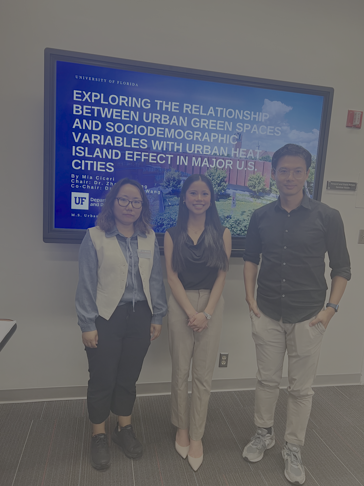

---
hide:
  - toc
  - navigation
---
<!--
CHECKLIST FOR THIS PAGE:
- [ ] Edit the skill cards to match your actual skills (add, remove, or rename cards as needed)
- [ ] Update GitHub and LinkedIn links in the Connect section
- [ ] Add your CV PDF to docs/assets/ and update the filename in the Download CV button
-->

  
  <h1>Mia Ciceri</h1>
  
<strong>GIS Analyst</strong>

  
<em>Geospatial Analysis | Urban Planning | AI/ML</em>

  <h2>About Me</h2>
  

    Hello! My name is Mia Ciceri, and I am a geospatial analyst with a background in geography, urban planning, and machine learning. I am a recent University of Florida graduate (go gators!), and I work on extracting actionable insights from remote sensing units and large spatial datasets using Python, Google Earth Engine, R, and open-source GIS software.
  

  

    My abilities in ArcGIS, QGIS, AutoCAD, RStudio, and VSCODE help shape my end-to-end GIS workflows into professional, presentation-ready final deliverables. I am passionate about applying GeoAI techniques to real-world challenges in land use mapping, climate monitoring, and urban planning. I am currently working in GIS analysis, urban analytics, and computer engineering in Florida.
  

  

    Check out my portfolio to learn about my skills, experience, and projects (including this website I built!)
  

  

---

[View My Projects :material-arrow-right:](projects/index.md){ .md-button .md-button--primary }
[Download CV :material-download:](assets/CV.pdf){ .md-button }

---

## Skills

-   :material-layers:{ .lg .middle } **GIS & Remote Sensing**

    ---

    - ArcGIS Pro, QGIS, Google Earth Engine
    - Landsat, Sentinel, Terra/Aqua imagery
    - Multispectral and singleband image analysis
    - Vector geometry & raster geometry

-   :material-code-braces:{ .lg .middle } **Programming**

    ---

    - Python — GeoPandas, NumPy, Matplotlib
    - R — sf, terra, ggplot2
    - SQL
    - JavaScript, HTML

-   :material-star-four-points:{ .lg .middle } **Machine Learning & Geostatistics**

    ---

    - Supervised classification — Random Forest, KNN, SVM
    - Neural networks - CNN, RNN, encoder-decoder
    - Cluster detection - LISA, HH-LL
    - Spatial interpolation - surface modeling, raster interpolation

---

## Connect

[GitHub](https://github.com/miaciceri){ .md-button }
[LinkedIn](https://linkedin.com/in/mia-ciceri){ .md-button }
